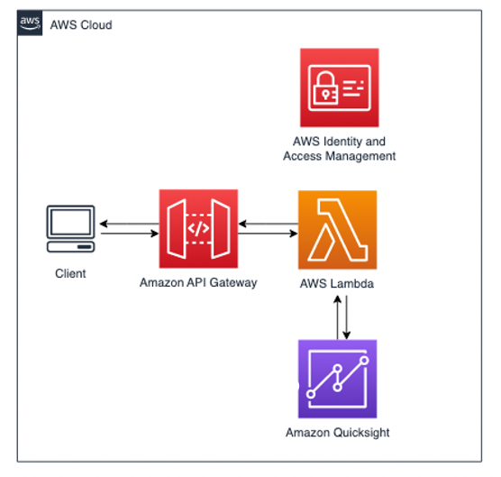
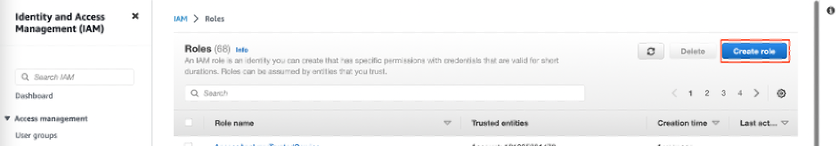
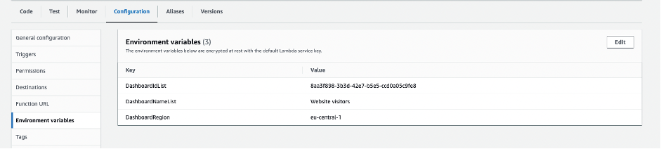
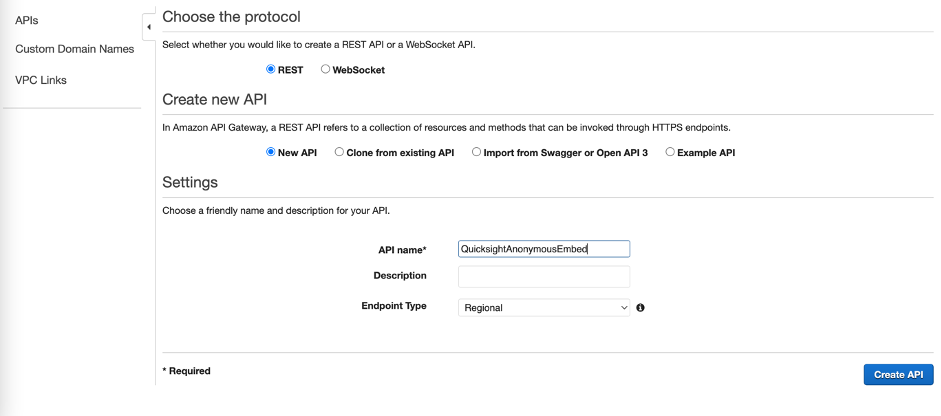
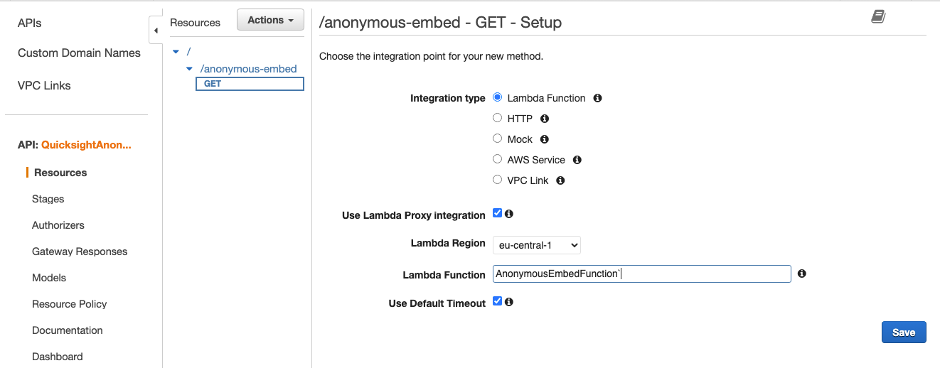
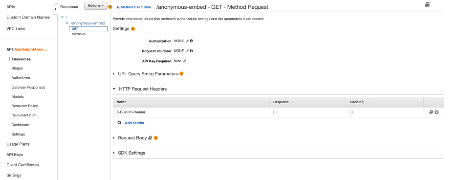
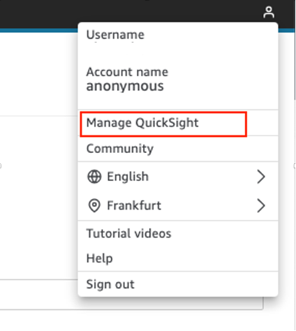
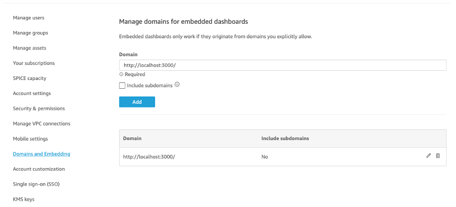

# How to Publicly embed your quicksight dashboard into your react application using aws sdk

Using embedded analytics from Amazon Quicksight can simplify the process of equipping your application with functional visualisations without any complex development. There are multiple ways to embed Amazon Quicksight dashboards into application. In this workshop we will look at how it can be done using React and AWS SDK. 

Today we will work with:
1.	Amazon Quicksight
2.	Amazon API Gateway
3.	AWS Lambda
4.  AWS Identity and Access Management (IAM)

Below you can find an architecture of the solution we are going to deploy.



Above, a user makes a request to Amazon API gateway that executes a Lambda function which in turn will make a call to QuickSight to request an embed URL that returns the dashboard. Lambda function assumes a role that has required permissions to create anonymous embed URLs. 
## Prerequisites
•	An AWS Account
•	An Amazon Quicksight account with session capacity pricing enabled
•	An Amazon Quicksight dashboard (see [AWS documentation](https://docs.aws.amazon.com/quicksight/latest/user/example-analysis.html) for more detailed steps on how to create one)
•	A sample React appliacation ([here](https://reactjs.org/docs/create-a-new-react-app.html#create-react-app) you can find steps on how to start)
## Step 1: In your AWS account, set up permissions for unauthenticated viewers
Create a policy in AWS Identity and Access Management (IAM) that your application will assume on behalf of the viewer. Go to *Policies* and select *Create policy* button. Next, choose a JSON tab and paste a policy that looks as following:
```
{
    "Version": "2012-10-17",
    "Statement": [
        {
            "Action": [
                "quicksight:GenerateEmbedUrlForAnonymousUser"
            ],
            "Resource": [
                "arn:aws:quicksight:*:*:namespace/default",
                "arn:aws:quicksight:*:*:dashboard/<YOUR_DASHBOARD_ID>"
            ],
            "Effect": "Allow"
        },
        {
            "Action": [
                "logs:CreateLogGroup",
                "logs:CreateLogStream",
                "logs:PutLogEvents"
            ],
            "Resource": "*",
            "Effect": "Allow"
        }
    ]
}
```
Since we are opening up anonymous access using this policy, be sure to enable this only for specific dashboards. In this example, we are using default namespace which can be changed to the namespace associated with a particular ISVs to track usage at a customer level.
In this policy we are allowing to perform *GenerateEmbedUrlForAnonymousUser* action on the dashboard ID inserted in the placeholder as well as creating a log group with the specified name, log stream for the specified log group and uploading a batch of log events to the specified log stream.

Give your policy name like: *AnonymousEmbedPolicy* and select *Create policy* button.


Next, create a role to which we will be attaching the *AnonymousEmbedPolicy*. Go to *Roles* and select *Create role* button. As a trusted entity select: *Lambda* and in the next screen search for *AnonymousEmbedPolicy*. Check the box next to the policy name and select *Next*. In the Name, Review, Create section, give your role a name like: *AnonymousEmbedRole*. Make sure that the policy name is included in the *Add permissions* section.
## Step 2: Generate anonymous embed URL lambda

Create a lambda function that generates the embed URL for the dashboard.  

In the AWS Console Go to Lambda and select function button.
Choose:
- Author from scratch
- Function Name: AnonymousEmbedFunction
- Runtime: Python 3.9
- Execution role: Use an existing role
- Select AnonymousEmbedRole from drop down. Click Create function.
In the Code tab, paste the code below:

```
import json, boto3, os, re, base64

def lambda_handler(event, context):

    try:
        def getQuickSightDashboardUrl(awsAccountId, dashboardIdList, dashboardRegion):
            #Create QuickSight client
            quickSight = boto3.client('quicksight', region_name=dashboardRegion);
            #Construct dashboardArnList from dashboardIdList
            dashboardArnList=[ 'arn:aws:quicksight:'+dashboardRegion+':'+awsAccountId+':dashboard/'+dashboardId for dashboardId in dashboardIdList]
            #Generate Anonymous Embed url
            response = quickSight.generate_embed_url_for_anonymous_user(
                     AwsAccountId = awsAccountId,
                     Namespace = 'default',
                     ExperienceConfiguration = {'Dashboard':{'InitialDashboardId':dashboardIdList[0]}},
                     AuthorizedResourceArns = dashboardArnList,
                     SessionLifetimeInMinutes = 60
                 )
            return response
        

        #Get AWS Account Id
        awsAccountId = context.invoked_function_arn.split(':')[4]
    
        #Read in the environment variables
        dashboardIdList = re.sub(' ','',os.environ['DashboardIdList']).split(',')
        dashboardNameList = os.environ['DashboardNameList'].split(',')
        dashboardRegion = os.environ['DashboardRegion']
    
        response={} 
    
        response = getQuickSightDashboardUrl(awsAccountId, dashboardIdList, dashboardRegion)
       
        return {'statusCode':200,
                'headers': {"Access-Control-Allow-Origin": "http://localhost:3000",
                            "Content-Type":"text/plain"},
                'body':json.dumps(response)
                } 


    except Exception as e: #catch all
        return {'statusCode':400,
                'headers': {"Access-Control-Allow-Origin": "http://localhost:3000",
                            "Content-Type":"text/plain"},
                'body':json.dumps('Error: ' + str(e))
                }     
```

If you don’t use localhost, replace `http://localhost:3000` in the returns with the hostname of your application. 

Go to *configuration* tab and in the General configuration select *Edit* button. Increase the timeout from 3 to 30 sec and select *Save* button.

Next, go to the Environment variables and select Edit button. Add following environment variables and select Save button. Those values you can find in the URL of your dashboard.

`https://us-east-1.quicksight.aws.amazon.com/sn/dashboards/xxxxxxxx-xxxx-xxxx-xxxx-xxxxxxxxxxxx`

- DashboardIdList : `xxxxxxxx-xxxx-xxxx-xxxx-xxxxxxxxxxxx`
- DashboardNameList : `NAME_OF_YOUR_DASHBOARD`
- DashboardRegion : `REGION_OF_YOUR_DASHBOARD`



Next go back to the Code tab and select Deploy button.

## Step 3: Setup API Gateway to invoke AnonymousEmbedFunction Lambda function

1.	In your AWS console, go to *API Gateway*, find a *REST API* section and select *Build* button.
In the *Create new API* section select *New API*. In the API name enter *QuicksightAnonymousEmbed* and select *Create API* button (see the picture below)



2.	Select *Actions* button and select *Create Resource* and enter *anonymous-embed* in the *Resource Name*. Next, select *Create Resource*.
3.	Select *anonymous-embed* resource and select *Action* button, then select *Create Method* and choose *GET*. 
In the *GET* method setup select *Lambda Function* as an integration type, enable *Lambda proxy integration* option and in the field *Lambda Function* search for previously created *AnonymousEmbedFunction*. Click *Save *and *OK* (See the picture below).



4.	Now, in order to enable dashboard functionality to switch between dashboards, let’s create HTTP Request Header to process custom headers that are passed from the app when the dashboard is selected.
•	Select *GET* method
•	Go to HTTP Request Header section 
•	Select *Add header*
•	Set *X-Custom-Header* as the name and save

After successful save your screen should look as on the screenshot below.



5.	To deploy the API, follow these steps:
•	Click on the "Actions" button and select Deploy API
•	In the Deployment stage select the option [New Stage]
•	Give your new stage a name, such as embed, and click on the Deploy button.

## Step 4: In Amazon QuickSight, add your domain to the allowed your domains



In the Amazon Quicksight console, go to *Manage Quicksight* (see the picture above) and add your application URL to the allowed domain list. If it is just for the testing purposes for now, just put the `https://localhost:<PortNumber>`. Make sure to replace`<PortNumber>` to match your local setup. See the picture below:



## Step 5: Turn on capacity pricing
If you don't have session capacity pricing enabled, follow the steps below. It’s mandatory to have this function enabled to proceed further.

In order to activate capacity pricing, go to the settings and select *Your subscriptions*. Next select *Get monthly subscription* in the *Capacity pricing* section and select *Confirm subscription* button. 

## Step 6: Call Amazon API Gateway from your React application
In your React project folder, go to your root directory and run: `npm i amazon-quicksight-embedding-sdk` to install amazon-quicksight-embedding-sdk package.
In your App.js file replace: `YOUR_API_GATEWAY_INVOKE_URL/RESOURCE_NAME` with your Amazon API Gateway invoke URL and your resource name (ie."`https://xxxxxxxx.execute-api.xx-xxx-x.amazonaws.com/embed/anonymous-embed`".
YOUR_DASHBOARD_ID with one dashboardId from your DashboardIdList.

Code snippet below represents an example of the App.js file in your React project. 
The code below is a React component that embeds an Amazon QuickSight dashboard. Here is an overview of what each part of the code does:

1.	State Hooks: Sstate hook is defined using the useState() hook from React
•	dashboardRef
2.	Ref Hook: A ref hook is defined using the useRef() hook from React. It is used to hold a reference to the DOM element where the QuickSight dashboard will be embedded.
3.	useEffect() Hook: The useEffect() hook is used to trigger the embedding of the QuickSight dashboard whenever the selected dashboard ID changes. It first fetches the dashboard URL for the selected ID from the Amazon QuickSight API using the fetch() method. Once the URL is retrieved, it calls the embed() function with the URL as the argument.

```
import './App.css';
import * as React from 'react';
import { useEffect, useRef } from 'react';
import { createEmbeddingContext } from 'amazon-quicksight-embedding-sdk';

function App() {
  const dashboardRef = useRef([]);

  const embed = async (dashboardurl) => {
    const embeddingContext = await createEmbeddingContext();
    const { embedDashboard } = embeddingContext;
    const options = {
      url: dashboardurl,
      container: dashboardRef.current,
      scrolling: "no",
      height: "500px",
      width: "600px", footerPaddingEnabled: true, iconDisabled: true
    };

    embedDashboard(options)
  };

  useEffect(() => {
    fetch("https://xiw2a6h5gj.execute-api.eu-central-1.amazonaws.com/test/anonymous-embed-sample"
    ).then((response) => response.json()
    ).then((response) => { embed(response.EmbedUrl) })
  }, [dashboardRef]);


  return (
    <>
      <h3>Your Dashboard</h3>
      <div ref={dashboardRef} />
    </>
  );
};

export default App;
```

Now it’s time to test your app. Start your application running `npm start` in your terminal. 
