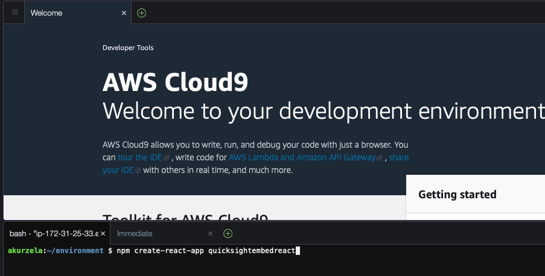
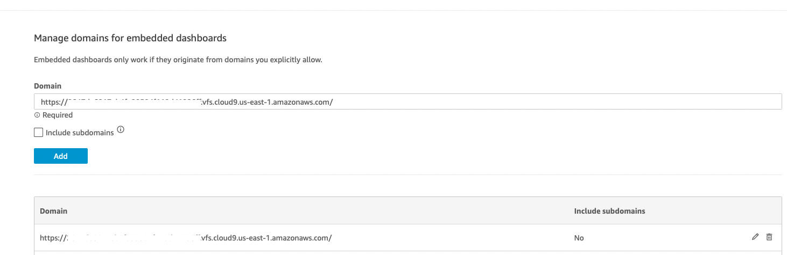
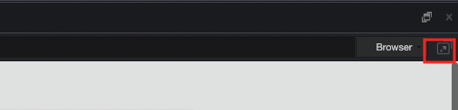

# How to Publicly embed your quicksight dashboard into your react application using aws sdk

Using embedded analytics from Amazon Quicksight can simplify the process of equipping your application with functional visualisations without any complex development. There are multiple ways to embed Amazon Quicksight dashboards into applications. In this workshop we will look at how it can be done using React and the AWS SDK. 

Today we will work with:
1.	Amazon Quicksight
2.	Amazon API Gateway
3.	AWS Lambda
4.  AWS Identity and Access Management (IAM)

Below you can find an architecture of the solution we are going to deploy.


Above, a user makes a request to Amazon API gateway that executes a Lambda function which in turn will make a call to QuickSight to request an embed URL that returns the dashboard. The Lambda function assumes a role that has the required permissions to create anonymous embed URLs. 
## Prerequisites
- An AWS Account
- An Amazon Quicksight account
-	Optional: An Amazon Quicksight dashboard (see [AWS documentation](https://docs.aws.amazon.com/quicksight/latest/user/example-analysis.html) for more detailed steps on how to create one) - alternatively, we will create one in Step 0

## Step 0: Create your Amazon Quicksight dashboard
In the AWS console, search for Quicksight or use [this](https://quicksight.aws.amazon.com/) link.

### Create an analysis
In the left hand side menu navigate to **Analyses** and click on the **New analysis** button in the right top corner. 
You will be able to see sample datasets automatically generated when you create an account in Amazon QuickSight. 
- Business overview
- People overview
- Sales pipeline
- Web and marketing analytics
These datasets were created by 47Lining, an AWS Advanced Consulting Partner with Big Data Competency designation.

### Add a visual
Pick **People Overview** and select **USE IN ANALYSIS**

Click on the field wells to to expand the fields. 

In the field list on the left-hand side, pick *Business Function* and place it in the Y axis, then pick *Employee ID* and place it in the Value field. Next, in the visual types menu at the bottom select a *Pie chart*. 


### Change the title
Next, double-click on the title of the visual *Count of Employee Id by Business Function* and change it to: *Employee Business Function Percentage Split*. 


### Publish the dashboard
Navigate to the top right corner and click the share-button to publish the analysis as a dashboard. Next, select **Publish dashboard**.


Select **Publish new dashboard as**, give it a name ie. *My Awesome Dashboard* and click on **Publish dashboard**


## Step 1: Create your react application
Back in the AWS console, search for Cloud9 and open the Cloud9 IDE if you already have one. If not, click on **Create environment**, type in a name and click **Create** at the bottom of the page. Wait until the creation has finished until you open the Cloud9 IDE.

In the terminal at the bottom of the Cloud9 IDE, create a React app using the `npx create-react-app quicksightembedreact` command. It will generate a React project for you.


## Step 2: In your AWS account, set up permissions for unauthenticated viewers
Back in the console, go to AWS Identity and Access Management (IAM). 

Create a policy in IAM for a role that your application will assume on behalf of the viewer. Go to **Policies** and click the **Create policy** button. Next, choose the JSON tab and paste a policy that looks as following:
```
{
    "Version": "2012-10-17",
    "Statement": [
        {
            "Action": [
                "quicksight:GenerateEmbedUrlForAnonymousUser"
            ],
            "Resource": [
                "arn:aws:quicksight:*:*:namespace/default",
                "arn:aws:quicksight:*:*:dashboard/<YOUR_DASHBOARD_ID>"
            ],
            "Effect": "Allow"
        },
        {
            "Action": [
                "logs:CreateLogGroup",
                "logs:CreateLogStream",
                "logs:PutLogEvents"
            ],
            "Resource": "*",
            "Effect": "Allow"
        }
    ]
}
```
Give your policy name like: *AnonymousEmbedPolicy* and click the **Create policy** button.


Next, create a role to which we will be attaching the *AnonymousEmbedPolicy*.
Go to **Roles** and click the **Create role** button. 
As a trusted entity select: **Lambda** and in the next screen search for **AnonymousEmbedPolicy**. 
Check the box next to the policy name and click **Next**. 
In the Name, Review, Create section, give your role a name like: *AnonymousEmbedRole*. Make sure that the policy name is included in the *Add permissions* section.

## Step 3: Generate anonymous embed URL lambda

Create a Lambda function that generates the embed URL for the dashboard.  

In the AWS Console go to Lambda and click the **Create function** button.
Choose:
- Author from scratch
- Function Name: *AnonymousEmbedFunction*
- Runtime: Python 3.9
- Execution role: Use an existing role
- Select *AnonymousEmbedRole* from drop down. 

Click **Create function**.
In the Code tab, paste the code below:

```
import json, boto3, os, re, base64

def lambda_handler(event, context):

    try:
        def getQuickSightDashboardUrl(awsAccountId, dashboardIdList, dashboardRegion):
            #Create QuickSight client
            quickSight = boto3.client('quicksight', region_name=dashboardRegion);
            #Construct dashboardArnList from dashboardIdList
            dashboardArnList=[ 'arn:aws:quicksight:'+dashboardRegion+':'+awsAccountId+':dashboard/'+dashboardId for dashboardId in dashboardIdList]
            #Generate Anonymous Embed url
            response = quickSight.generate_embed_url_for_anonymous_user(
                     AwsAccountId = awsAccountId,
                     Namespace = 'default',
                     ExperienceConfiguration = {'Dashboard':{'InitialDashboardId':dashboardIdList[0]}},
                     AuthorizedResourceArns = dashboardArnList,
                     SessionLifetimeInMinutes = 60
                 )
            return response
        

        #Get AWS Account Id
        awsAccountId = context.invoked_function_arn.split(':')[4]
    
        #Read in the environment variables
        dashboardIdList = re.sub(' ','',os.environ['DashboardIdList']).split(',')
        dashboardNameList = os.environ['DashboardNameList'].split(',')
        dashboardRegion = os.environ['DashboardRegion']
    
        response={} 
    
        response = getQuickSightDashboardUrl(awsAccountId, dashboardIdList, dashboardRegion)
       
        return {'statusCode':200,
                'headers': {"Access-Control-Allow-Origin": "[CLOUD9URLPLACEHOLDER]",
                            "Content-Type":"text/plain"},
                'body':json.dumps(response)
                } 


    except Exception as e: #catch all
        return {'statusCode':400,
                'headers': {"Access-Control-Allow-Origin": "[CLOUD9URLPLACEHOLDER]",
                            "Content-Type":"text/plain"},
                'body':json.dumps('Error: ' + str(e))
                }     
```

Replace `[CLOUD9URLPLACEHOLDER]` in both of the returns with the origin URL of your Cloud9 instance. It should look similar to **https://#######################.vfs.cloud9.us-east-1.amazonaws.com**. You can compose it using the Cloud9 URL, ie. https://us-east-1.console.aws.amazon.com/cloud9/ide/[STRING_TO_PUT_IN_PLACE_OF_###########]. Make sure to not include a slash at the end of the string.

Go to the **Configuration** tab and in the **General configuration** click the **Edit** button. Increase the timeout from 3 to 30 sec and hit the **Save** button.

Next, go to the **Environment variables** and click the **Edit** button. Add the following environment variables and click the **Save** button. These values you can find in the URL of your dashboard.

`https://us-east-1.quicksight.aws.amazon.com/sn/dashboards/xxxxxxxx-xxxx-xxxx-xxxx-xxxxxxxxxxxx`

- DashboardIdList : `xxxxxxxx-xxxx-xxxx-xxxx-xxxxxxxxxxxx` (see URL)
- DashboardNameList : `NAME_OF_YOUR_DASHBOARD` (the one you set in Step 0)
- DashboardRegion : `REGION_OF_YOUR_DASHBOARD` (see URL)


Next go back to the **Code** tab and click the **Deploy** button.

## Step 4: Setup API Gateway to invoke AnonymousEmbedFunction Lambda function

1.	In your AWS console, go to **API Gateway**, find the **REST API** section and click the **Build** button.
In the **Create new API** section select **New API**. In the API name enter *QuicksightAnonymousEmbed* and click the **Create API** button (see the picture below)


2.	Click the **Actions** button, select **Create Resource** and enter *anonymous-embed* in the **Resource Name**. Next, click **Create Resource**.
3.	Select *anonymous-embed* resource and click the **Action** button, then select **Create Method** and choose **GET**. 
In the **GET** method setup select **Lambda Function** as an integration type, enable **Lambda proxy integration** option and in the field **Lambda Function** search for the previously created *AnonymousEmbedFunction*. Click **Save** and **OK** (See the picture below).


4.	Now, in order to enable dashboard functionality to switch between dashboards, let’s create a HTTP Request Header to process custom headers that are passed from the app when the dashboard is selected.
-	Select the **GET** method
- Click on **Method Request**
-	Go to the HTTP Request Header section 
-	Select **Add header**
-	Set *X-Custom-Header* as the name and save

After the successful save your screen should look as on the screenshot below.


5.	To deploy the API, follow these steps:
-	Click on the **Actions** button and select **Deploy API**
-	In the Deployment stage select the option **[New Stage]**
-	Give your new stage a name, such as *embed*, and click on the **Deploy** button.

Make note of the URL shown at the top of the page, you will need to insert this later into your React code (Step 7).

## Step 5: In Amazon QuickSight, add your domain to the allowed your domains
In the Amazon Quicksight console, click the user-icon in the top right and go to **Manage Quicksight** and add your Cloud9 URL to the allowed domain list. See the picture below:



## Step 6: Turn on capacity pricing
If you don't have session capacity pricing enabled, follow the steps below. It’s mandatory to have this function enabled to proceed further.

In order to activate capacity pricing, click on **Your subscriptions** on the left. Next, select **Get monthly subscription** in the **Capacity pricing** section and select **Confirm subscription** button. 

## Step 7: Call Amazon API Gateway from your React application
Go back to your Cloud9 IDE. In your React project folder, go to your root directory and run: `npm i amazon-quicksight-embedding-sdk` to install amazon-quicksight-embedding-sdk package.

Go to your App.js file and replace the existing code with the code snippet below. Make sure to replace: `YOUR_API_GATEWAY_INVOKE_URL/STAGE_NAME/RESOURCE_NAME` with your Amazon API Gateway invoke URL and your resource name (ie."`https://xxxxxxxx.execute-api.xx-xxx-x.amazonaws.com/embed/anonymous-embed`".

Quicksight may put a warning on line 24 that the command *fetch* is not defined. You can ignore this.

The Code snippet below represents an example of the App.js file in your React project. 
It is a React component that embeds an Amazon QuickSight dashboard. Here is an overview of what each part of the code does:

1.	useState Hooks: used to define a state of the variable.
2.	useRef Hook: used to hold a reference to the DOM element where the QuickSight dashboard will be embedded.
3.	useEffect() Hook: The useEffect() hook is used to trigger the embedding of the QuickSight dashboard whenever the selected dashboard ID changes. It first fetches the dashboard URL for the selected ID from the Amazon QuickSight API using the fetch() method. Once the URL is retrieved, it calls the embed() function with the URL as the argument.
4. The purpose of createEmbeddingContext is to generate an embedding context object that can be used to configure and interact with the QuickSight embedding SDK. 

```
import './App.css';
import * as React from 'react';
import { useEffect, useRef } from 'react';
import { createEmbeddingContext } from 'amazon-quicksight-embedding-sdk';

function App() {
  const dashboardRef = useRef([]);

  const embed = async (dashboardurl) => {
    const embeddingContext = await createEmbeddingContext();
    const { embedDashboard } = embeddingContext;
    const options = {
      url: dashboardurl,
      container: dashboardRef.current,
      scrolling: "no",
      height: "500px",
      width: "600px", footerPaddingEnabled: true, iconDisabled: true
    };

    embedDashboard(options)
  };

  useEffect(() => {
    fetch("YOUR_API_GATEWAY_INVOKE_URL/STAGE_NAME/RESOURCE_NAME"
    ).then((response) => response.json()
    ).then((response) => { embed(response.EmbedUrl) })
  }, [dashboardRef]);

  return (
    <>
      <h3>Your Dashboard</h3>
      <div ref={dashboardRef} />
    </>
  );
};

export default App;
```

Now it’s time to test your app. Start your application running `npm start` in your terminal. To preview your app, click on **Preview** and select **Preview Running Application**. If the dashboard doesn't load in the preview - click on the Pop into new Window button.




